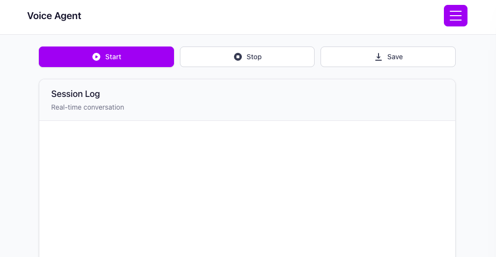

# 1. webRTC based S2S

[OpenAI Voice Agents Quickstart](https://openai.github.io/openai-agents-js/guides/voice-agents/quickstart/)
[Upgrade guide](https://openai.github.io/openai-agents-js/guides/voice-agents/build/)

webRTC based OpenAI realtime api should be written on JS type.

```bash
npm install
echo "OPENAI_API_KEY=your_api_key_here" > .env
npm run server
npm run dev
```

```text
[브라우저]  --(HTTPS)-->  [내 서버] --(API Key)--> [OpenAI /v1/realtime/sessions]
                         (OpenAI API Key는 서버에만 있음)
[내 서버] <-- ephemeral key -- [OpenAI]
[브라우저] <-- ephemeral key -- [내 서버]
[브라우저] --(ephemeral key, WebRTC)--> [OpenAI Realtime API]
```

## Browser


# 2. webSocket based S2S

현재 코드는 미완성 / 대화는 되지만 지금 audio output과 server output의 sync를 관리해야됨.

1. Server VAD가 사용자 발화를 감지하면 즉시 server-side interruption이 걸리고, 새로운 TTS audio delta 전송이 중단된다.
2. 하지만 Client 측은 이미 받은 audio가 WebSocket → AudioPlayer queue → PyAudio buffer에 남아 계속 재생된다.
3. 이 local playback latency가 server 이벤트 타이밍보다 커서, 실제로는 끊겼어도 귀에는 TTS가 이어지는 것처럼 들린다.
4. 그 결과 대화 흐름이 밀리고, 새 response는 기존 audio가 drain될 때까지 체감상 지연된다.
5. 대응: client-side에서 audio queue 즉시 flush/stop, buffer 최소화, 필요 시 WebRTC로 전환해 end-to-end latency와 sync 오차를 줄인다.

- 해결책으로 `conversation.item.truncate`를 찾아보기는 해야됨(cancel+truncate+flush)

```text
[Python Client] --(WebSocket, API Key)--> [OpenAI Realtime API]
     ↑↓
[Audio I/O (PyAudio)]
```

Setup

```bash
# with venv
pip install -r requirements.txt

echo "OPENAI_API_KEY=your_api_key_here" > .env

python main.py
```

# git action

```bash
# if action occured, do below command in local
git pull --rebase origin main
```

## 📝 Recent Commits

| Hash | Message | Author | Date |
|------|---------|--------|------|
| `08abb7b` | feat: handoff(korean 20 agent) + logging time | Duhyeon | 2025-08-17 |
| `b4794b3` | docs: auto-update commit log [skip ci] | github-actions[bot] | 2025-08-15 |
| `1b01044` | feat: error box added and session.message send if session started | Duhyeon | 2025-08-15 |
| `b1aee27` | docs: auto-update commit log [skip ci] | github-actions[bot] | 2025-08-14 |
| `ef73530` | feat: history hamburger menu added(you can see the transcription of webRTC S2S conversation) | Duhyeon | 2025-08-14 |
| `4c4d23f` | docs: auto-update commit log [skip ci] | github-actions[bot] | 2025-08-13 |
| `8500eba` | feat: webUI applied for logging realtimesession events | Duhyeon | 2025-08-13 |
| `0513586` | docs: auto-update commit log [skip ci] | github-actions[bot] | 2025-08-11 |
| `06af719` | docs: auto-update commit log [skip ci] | github-actions[bot] | 2025-08-10 |
| `5f0dba7` | fix: websocket version slight change(not perfect) | Duhyeon | 2025-08-10 |

*Last updated: 2025-08-17 11:57:32 UTC*
